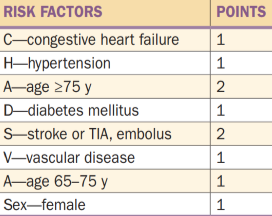
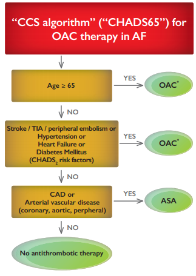
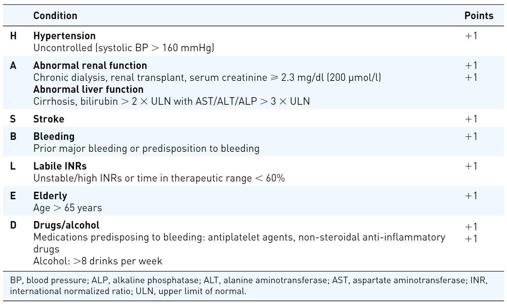

# Atrial Fibrillation

## **Definitions & Background**

**Atrial fibrillation \(AF\)** is disorganized, rapid, irregular atrial activation with resulting loss of normal atrial contractions, and irregular ventricular rate. Untreated, the ventricular rate tends to be rapid and variable in the range of 120-160 bpm. AF is the most common sustained arrhythmia.

**Risk factors** can be divided into modifiable and non-modifiable risk factors:

<table>
  <thead>
    <tr>
      <th style="text-align:left">Modifiable</th>
      <th style="text-align:left">Non-Modifiable</th>
    </tr>
  </thead>
  <tbody>
    <tr>
      <td style="text-align:left">
        <ul>
          <li>hypertension</li>
          <li>obesity</li>
          <li>obstructive sleep apnea</li>
          <li>diabetes mellitus</li>
          <li>chronic kidney disease</li>
          <li>heavy alcohol use</li>
        </ul>
      </td>
      <td style="text-align:left">
        <ul>
          <li>age (&gt;95% of patients are 60 or older)</li>
          <li>male sex</li>
          <li>underlying cardiac disease</li>
          <li>Caucasian race</li>
        </ul>
      </td>
    </tr>
  </tbody>
</table>

**Triggers** of atrial fibrillation are varied:

| Category | Causes |
| :--- | :--- |
| Cardiovascular | ischemic heart disease, valvular heart disease, hypertension, pericardial disease, cardiomyopathy, pulmonary embolism |
| Conduction | pre-excitation syndromes |
| Metabolic | thyrotoxicosis, electrolyte abnormalities \(hypoK, hypoMg\), acid-base abnormalities |
| Systemic | acute infection, surgery |
| Ingestion | acute alcohol consumption, sympathomimetics, digoxin, theophylline, adenosine |

Caffeine is not associated with atrial fibrillation.

**EKG findings** are an irregularly irregular rhythm, no P waves, no isoelectric baseline, variable ventricular rate, narrow QRS \(usually\), and possibly fine/coarse high-frequency fibrillatory waves (which may mimic P waves). The ventricular rate is often 110 to 160 bpm, and if it is above 100 then it is AF **with rapid ventricular response** a.k.a. "AFRVR".

## Pathophysiology

Classically, AF can be a progressive condition that involves cardiac myocyte remodeling, fibrosis, and conduction abnormalities. Atrial dilatation, commonly seen in longstanding systemic hypertension, predisposes to ectopic atrial automaticity and abnormal electrical activity.

Atrial fibrillation promotes atrial fibrillation.

| Classification              | Definition                                                                                                                                                                                     | Process                                                                                |
|:--------------------------- |:---------------------------------------------------------------------------------------------------------------------------------------------------------------------------------------------- |:-------------------------------------------------------------------------------------- |
| **Subclinical AF \(SCAF\)** | "Asymptomatic episodes of AF detected by intracardiac, implantable, or wearable monitors and confirmed by intracardiac electrogram or review of the recorded rhythm on the electrocardiogram." | Unknown. Associated with progression to clinical AF, and with a risk of stroke.        |
| **Paroxysmal AF**           | Self-limiting, resolves within 7 days                                                                                                                                                          | Re-entry mechanism involving atrial muscle extending into the pulmonary veins \(PVs\). |
| **Persistent AF**           | Lasts more than 7 days, or does not spontaneously resolve.                                                                                                                                     | May involve the PVs, SVC, or the coronary sinus. Gradual fibrosis.                     |
| **Long-standing AF**        | Uninterrupted for more than 1 year                                                                                                                                                             | Chronic atrial fibrosis, and difficult to restore and maintain normal sinus rhythm.    |
| **Permanent AF**            | Cannot return to normal sinus rhythm \(NSR\)                                                                                                                                                   | Irreversible electrophysiological remodeling.                                          |

## Consequences

Loss of proper atrial contributions to ventricular filling promotes **atrial hemostasis with predisposition to left atrial appendage \(LAA\) thrombus formation**. Thromboembolic cerebrovascular disease results.

Rapid ventricular rates can cause **hemodynamic collapse**, or **heart failure exacerbations**. This is particularly true with hypertrophic cardiomyopathy or heart failure with preserved ejection fraction \(HFpEF\). Over time, uncontrolled AF can lead to **tachycardia-related cardiomyopathy.**

Otherwise, symptoms related to inconsistent cardiac output might include fatigability, exercise intolerance, dizziness, and syncope.

Why do we care if someone has AF? Because over time, it significantly increases the risk of serious and potentially irreversible conditions:

* mortality \(by 1.5-1.9x\)
* heart failure
* stroke \(by 5x, causes 25% of strokes\)
* dementia and vascular dementia

## Chronic Management of Atrial Fibrillation

In general, patients who maintain sinus rhythm have better survival than those who continue to have AF. Therapy focuses on controlling the ventricular response to disordered atrial contractions, and reducing the risk of thromboembolic disease.

### Rate versus Rhythm Control

In 2002, the [AFFIRM trial \(NEJM 2002\)](https://www.nejm.org/doi/full/10.1056/NEJMoa021328) compared **rate control strategies** \(beta blockers, non-DHP CCBs, digoxin; target HR &lt;80 at rest and &lt;110 during 6-min walk test\) to **rhythm control strategies** \(amiodarone, disopyramide, flecainide, moricizine, procainamide, propafenone, quinidine, sotalol, dofetilide, and cardioversion\) in **patients 65 or older with chronic non-valvular AF, and eligible for anticoagulation with warfarin \(target INR 2-3\).** Patients with rhythm control were encouraged to be on anticoagulation but were allowed to not be anticoagulated if NSR had been sustained for at least 4 \(ideally 12\) consecutive weeks. Patients with rate control had to be on constant anticoagulation. Overall, there was no survival differences between rate and rhythm approaches, but rhythm control trended towards increased mortality, especially in the elderly and those with no history of heart failure. There were fewer adverse drug effects with rate control.

!!! hint 
    1. Consider **rhythm control** if young and asymptomatic with no structural heart disease.
    2. Consider **rate control** if older with structural heart disease or a dilated left atrium.

### Rate Control

**Goal:** HR less than 100 at rest, according to the CCS Guidelines. However, the [RACE II trial \(NEJM 2010\)](https://www.nejm.org/doi/full/10.1056/NEJMoa1001337) demonstrated that, over three years with a broad CV composite outcome, a lenient rate target \(resting HR &lt;110 bpm\) was noninferior to a strict rate control target \(resting HR &lt; 80 bpm and &lt;110 bpm during moderate exercise\). Not only that, but a lenient target increased the target success rate, decreased visits necessary to reach the target, decreased the number of patients on medications at all, and decreased the dosages of beta blockers, verapamil, and combination therapy.

!!! fyi ""
    The **RACE II \(2010\)** trial supports a lenient heart rate approach \(&lt;110 bpm at rest\) in active patients with mild to moderate symptoms.

Common agents include: **beta blockers** \(metoprolol, bisoprolol, etc\), **non-DHP CCBs** \(diltiazem, verapamil\), **digoxin** \(lacks negative inotropic effects, may be useful in heart failure\).

1. **Beta blockers** are first-line therapy regardless of history of myocardial infarction or LV dysfunction.
2. **Non-DHP CCBs** are first-line as well with no history of MI or LV dysfunction. They are less preferred than BBs in the setting of CAD. Avoid in heart failure.
3. **Digoxin** is an option in those with LV systolic dysfunction, or if very sedentary. It is also used as add-on or second-line therapy to BBs and non-DHP CCBs.
4. **Amiodarone** is used in exceptional cases.
5. **Dronedarone** should not be used in permanent AF, or for the sole purpose of rate control. As well, do not use with history of heart failure or LVEF &lt; 40%. Be cautious if also using digoxin.

**AV node ablation** or a **permanent pacemaker** may be needed if maximum pharmacologic therapy fails to control rate.

### Rhythm Control

### Risk Stratification

Most patients will warrant chronic anticoagulation. It is particularly indicated for those with **mitral stenosis**, **HCM**, and **prior stroke**. Otherwise, we tend to use clinical decision rules and risk stratification scores to make these decisions.

#### Risk of Stroke

The **CHA\(2\)DS\(2\)-VASc** score has been used to estimate stroke risk in nonvalvular AF, and to make recommendations about chronic anticoagulation. Whether the AF is paroxysmal or persistent or not doesn't seem to make a large difference in terms of stroke risk. Long-term anticoagulation is indicated for women with score of 2 or more, and for men with a score of 3 or more.


**Valvular AF** is generally accepted to refer to atrial fibrillation with rheumatic heart disease \(mainly mitral stenosis\) and artificial heart valves.


| CHA\(2\)DS\(2\)-VASc Score | Estimated Annual Stroke Rate \(%\) |
| :--- | :--- |
| 0 | 0 |
| 1 | 1.3 |
| 2 | 2.2 |
| 3 | 3.2 |
| 4 | 4.0 |
| 5 | 6.7 |
| 6-9 | &gt;9 |


The annual risk of stroke starts at 0, and increases by approximately 1% for each point \(until 4, after which it increases dramatically\).


In Canada, the recent **CHADS65** algorithm has supplanted previous scores in determining if patients should be on chronic anticoagulation. This has greatly simplified decision making. Of course, therapy must always be guided by patient preferences and individual circumstances.

#### Risk of Bleeding

Any anticoagulant therapy increases the risk of bleeding; that is the nature of the mechanism. The **HAS-BLED** score estimates the risk of major bleeds. A score of 3 or more is considered high risk, and indicates close monitoring and followup.

### Anticoagulation

**Warfarin** has long been the standard anticoagulant for atrial fibrillation, and it remains the therapy of choice for those with mitral stenosis and mechanical heart valves. It is an epoxide reductase inhibitor that interferes with the activation of vitamin K in the body, mostly in the liver. It is particularly cheap, but requires monthly INR checks and has many drug-drug interactions. Onset of action is over several \(3-5\) days as enzyme inhibition does not have immediate effects of coagulation factors. Immediate reversal consists of prothrombin complex concentrate \(PCC/Octaplex; coag factors 2, 7, 9, 10 and proteins C and S\), fresh frozen plasma, and vitamin K. Vitamin K-dependent proteins are: **coagulation factors 2, 7, 9, 10; proteins C and S**

**Direct oral anticoagulants \(DOACs\)** are newer inhibitors of coagulation factors that are more expensive and more convenient. DOACs are noninferior to warfarin in individual head-to-head trials for stroke prevention in atrial fibrillation, and may actually be superior by a small margin for reduction of mortality, stroke, major bleeds, and intracranial hemorrhage. No DOACs have been directly compared so far. In severe renal disease, consider warfarin. Otherwise, adjust dosages with tools such as [Thrombosis Canada's Dosing Tool](https://thrombosiscanada.ca/tools/). Often, elderly patients are often inappropriately underdosed, meaning that they do not receive the proven benefits of anticoagulation, while receiving some of the bleeding risk.

<table>
  <thead>
    <tr>
      <th style="text-align:left">DOAC</th>
      <th style="text-align:left">Inhibited Factor</th>
      <th style="text-align:left">Dosing Considerations</th>
      <th style="text-align:left">Reversal Agent</th>
    </tr>
  </thead>
  <tbody>
    <tr>
      <td style="text-align:left">Dabigatran (Pradaxa)</td>
      <td style="text-align:left">IIa</td>
      <td style="text-align:left">
        
Avoid in ESRD

        
BID

      </td>
      <td style="text-align:left">idarucizumab (Praxbind)</td>
    </tr>
    <tr>
      <td style="text-align:left">Apixaban (Eliquis)</td>
      <td style="text-align:left">Xa</td>
      <td style="text-align:left">
        
Avoid in ESRD

        
BID

      </td>
      <td style="text-align:left">andexanet alfa (Andexxa)</td>
    </tr>
    <tr>
      <td style="text-align:left">Rivaroxaban (Xarelto)</td>
      <td style="text-align:left">Xa</td>
      <td style="text-align:left">
        
Avoid in ESRD

        
once daily

      </td>
      <td style="text-align:left">andexanet alfa (Andexxa)</td>
    </tr>
    <tr>
      <td style="text-align:left">Edoxaban (Lixiana)</td>
      <td style="text-align:left">Xa</td>
      <td style="text-align:left">once daily</td>
      <td style="text-align:left">andexanet alfa (Andexxa)</td>
    </tr>
  </tbody>
</table>

## Resources & References

1. [Macle, Laurent et al. 2016 Focused Update of the CCS Guidelines for the Management of Atrial Fibrillation. Can J Cardiol 2016;32:1170-1185](http://www.ccs.ca/eguidelines/Content/Topics/AtrialFib/_landing_page_atrial_fibrillation.htm)
2. [Wyse DG, Waldo AL, DiMarco JP, Domanski MJ, Rosenberg Y, Schron EB, et al. A comparison of rate control and rhythm control in patients with atrial fibrillation. N Engl J Med. 2002 Dec 5;347\(23\):1825–33. ](https://www.nejm.org/doi/full/10.1056/NEJMoa021328)
3. [Van Gelder IC, Groenveld HF, Crijns HJGM, Tuininga YS, Tijssen JGP, Alings AM, et al. Lenient versus strict rate control in patients with atrial fibrillation. N Engl J Med. 2010 Apr 15;362\(15\):1363–73. ](https://www.nejm.org/doi/full/10.1056/NEJMoa1001337)

