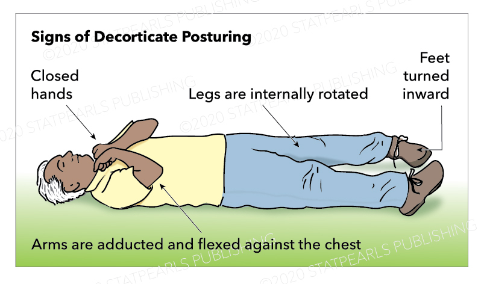

 # Decerebrate versus Decorticate
## Pathophysiology
   
These are ABNORMAL posturing of the muscles that indicate severe brain injury.

They occur due to incapacitation of one set of muscles, while an external stimulus (like pain) causes the other to contract unopposed, but can also happen without a stimulus.

They are unreliable in patients less than 2 years old due to immature nervous system.

The anatomical difference between decorticate and decerebrate is that the damage is generally **above the red nucleus** at the intercollicular level of the midbrain in decorticate, and **below** this in decerebrate.

## Decorticate Posturing
Flexed posturing indicates damage to the cerebral hemispheres.

## Decerebrate Posturing
Extension posturing indicates damage to the brain stem (more specifically, below the red nucleus at the intercollicular level of the midbrain)
