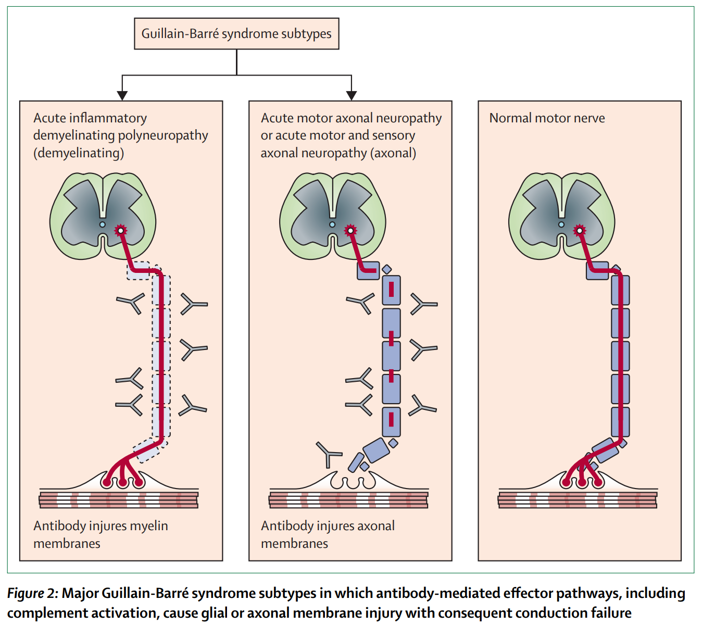
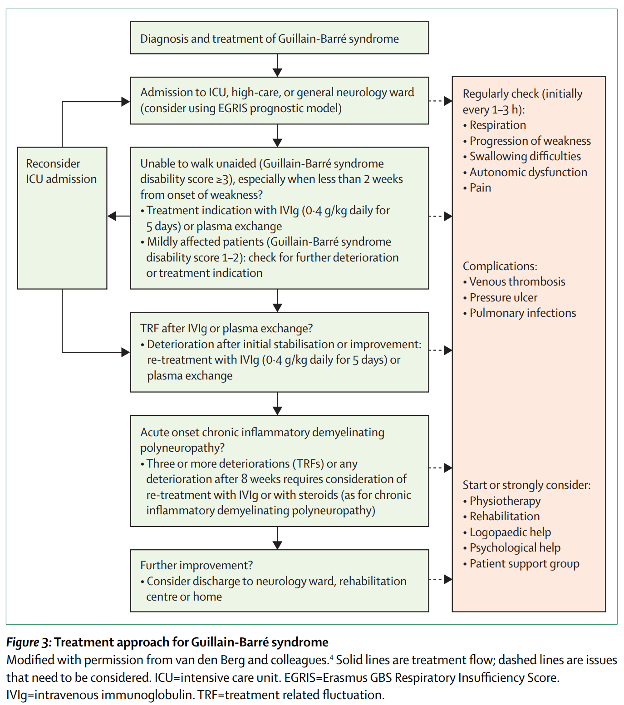

# Guillain-Barré Syndrome (GBS)
## Background
The most common and severe **acute paralytic neuropathy**. Incidence is 1:100,000. Increased risk with male sex and increased age. Follows a typical clinical pattern, usually preceded by infection or immune trigger. The diagnosis is largely clinical.

## Etiology
Onset is 1-2 weeks after immune stimulation.

- s/p **acute infectious process** (70%)
    - usually *respiratory or GI infection*
    - 20-30% of cases are due to *Campylobacter jejuni* specifically
    - Other common inciting pathogens are a HHV infection such as EBV or CMV, HIV, hepatitis E, influenza A, arboviruses (Zika virus, Chikungunya) *Mycoplasma pneumoniae*, *Haemophilus influenzae*
- s/p **vaccination**
    - H1N1 influenza virus
    - Semple Rabies vaccines
- **lupus**
- **lymphoma**

## Pathogenesis/Immunology
Essentially, this is an autoimmune process leading to **acute neuropathy** which can be either **(1) demyelinating** or **(2) axonal (motor or sensory)** in type. This process is likely antibody-mediated, driven by molecular mimicry between microbial and cellular surface antigens.

## Clinical Features

- **rapidly (hours to days) ascending  paralysis**
    - may be noticed as "rubbery legs" at first
    - frequently accompanied with tingling dysesthesias in the extremities
    - legs > arms
    - facial diparesis in 50%
    - lower cranial nerve involvement with bulbar weakness and difficulty handling secretions
    - areflexia
    - ventilatory support (30%) required
- cutaneous sensorium mostly preserved as these are small fibers that are not affected as much
- **autonomic involvement**
    - transient bladder dysfunction
    - loss of vasomotor control
        - blood pressure changes
        - postural hypotension
        - cardiac dysrhythmia
- **pain**
    - acute neck, back, spine pain (50%)
    - deep, aching muscular-type pain
    - dysesthetic pain in the extremites due to sensory fibre involvement

In terms of the **timeframe**, most patients plateau in symptoms within 4-6 weeks and progression beyond that point is unlikely. All patients improve but some may have residual symptoms.

### Miller-Fischer Syndrome
Defined by presence of **anti-GQ1b antibodies (90%)**. Often affects cranail nerves. This is a triad of:

1. Ophthalmoplegia
2. Ataxia
3. Areflexia

## Treatment of GBS

- **IVIG and plasmapheresis** are proven to help improve symptoms and prognosis in acute inflammatory demyelinating polyneuropathy.
    - steroids are not shown to be helpful
- General medical supportive care
    - Respiratory status and ventilation if needed
    - Cardiac and hemodynamic management (autonomic instability common)
    - Pain control
    - PT/OT/rehab
    - GI/GU
    - DVT ppx

## Prognosis

- Mortality is 3-7%
-   Death generally occurs from ventilatory failure, pulmonary complications, or from autonomic dysfunction --> arrhythmia
-   About 20% of patients with Guillain-Barré syndrome cannot walk unaided 6 months after onset
-   Most patients have residual pain and fatigue, which can in part be attributed to persistent axonal loss.